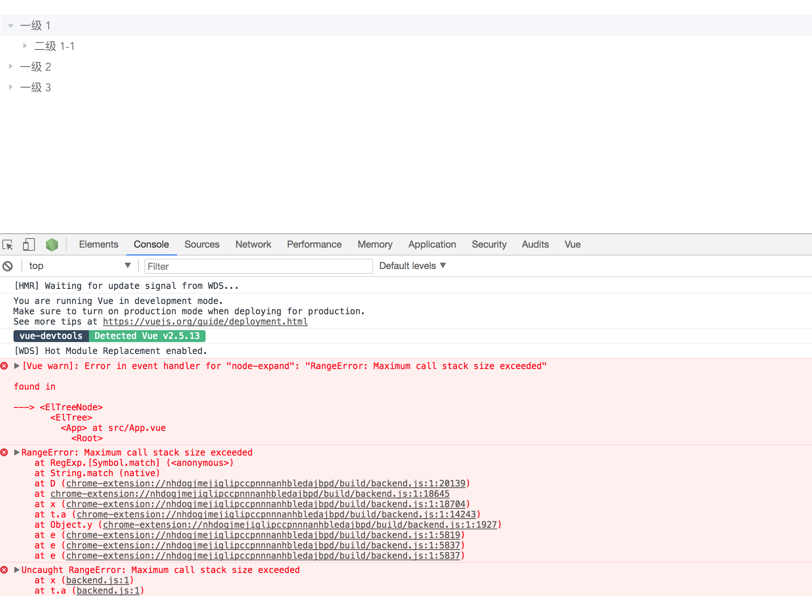

# vue-element-tree-bug

##
demo for bug element-ui tree and vue-devtools

steps

1. install [vue-devtools 4.0.1](https://chrome.google.com/webstore/detail/vuejs-devtools/nhdogjmejiglipccpnnnanhbledajbpd) from chrome webstore
1. npm install
1. npm run dev
1. click `test` button in page




## Build Setup

``` bash
# install dependencies
npm install

# serve with hot reload at localhost:8080
npm run dev

# build for production with minification
npm run build
```

For detailed explanation on how things work, consult the [docs for vue-loader](http://vuejs.github.io/vue-loader).
